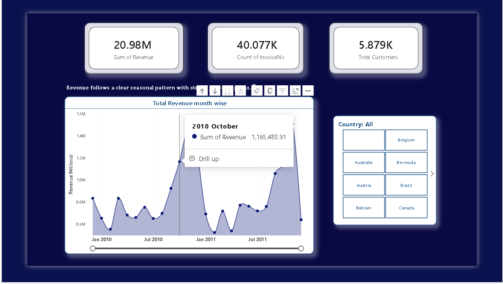
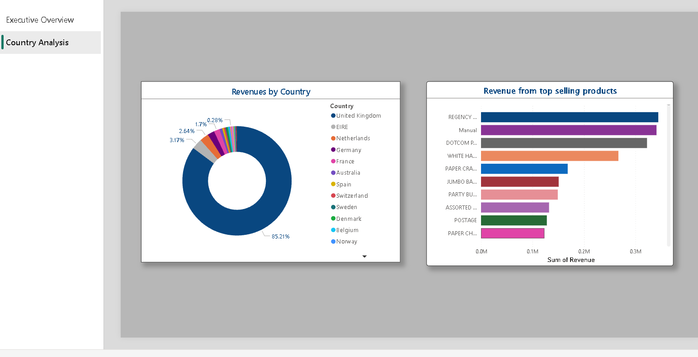

# Retail Sales Analysis – Power BI Dashboard

## 📌 Project Overview
This project analyzes retail transaction data to identify revenue trends, customer behavior, and country-wise performance using Power BI, SQL, Excel and DAX.

The dashboard is designed for business stakeholders to quickly understand:
- Overall revenue performance
- Seasonal sales patterns
- Country-level revenue contribution
- Top-performing products

---

## 🧩 Dataset
- Source: Online Retail transactional dataset
- Records: ~10 lakh invoices
- Time Period: 2009–2011

---

## 🛠 Tools & Skills Used
- Power BI (Data Modeling, DAX, Visual Design)
- SQL (Data Cleaning, Filtering, Logic Creation)
- DAX Measures
- Data Visualization & Storytelling

---

## 📊 Dashboard Pages

### 1️⃣ Executive Overview
**KPIs:**
- Total Revenue
- Total Invoices
- Total Customers

**Insights:**
- Revenue shows strong seasonality with clear year-end peaks
- Monthly revenue trends highlight demand spikes during festive periods

---

### 2️⃣ Country Analysis
**Visuals:**
- Revenue contribution by country
- Top-selling products by revenue

**Insights:**
- United Kingdom contributes ~85% of total revenue
- A small number of products generate a significant share of sales

---

## 📈 Key Business Insights
- Revenue is highly concentrated geographically
- Product sales follow a Pareto pattern
- Seasonal trends can inform inventory planning

---

## 📂 Files Included
- `Retail_Sales_Analysis.pbix` – Power BI dashboard
- `cleaned_data.csv` – cleaned dataset
- `data_cleaning.sql` – SQL queries used

---

## 🚀 Future Enhancements
- Customer segmentation (RFM analysis)
- Profitability metrics
- Forecasting using time-series models
